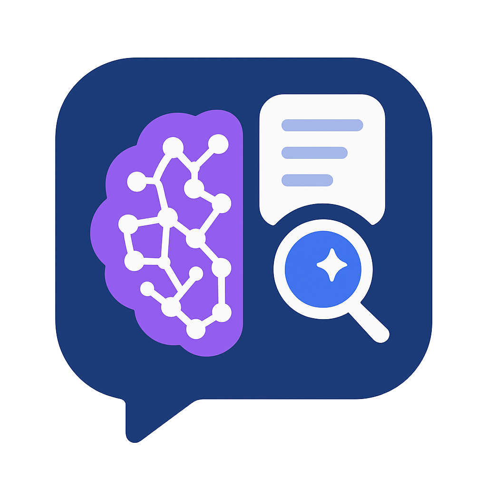

# Chat with AI-RAG

A modern, interactive chat application built with Next.js that demonstrates various AI conversation modes including Retrieval-Augmented Generation (RAG) capabilities. This application allows users to interact with an AI assistant in three different modes: Quick Chat, Memory Chat, and Contextual Chat with document support.

<p align="center">
  
</p>

## Features

- **Multiple Chat Modes:**
  - **Quick Chat**: Simple question-answer interactions without context memory
  - **Memory Chat**: Conversations with history retention for contextual responses
  - **Contextual Chat**: LangChain-powered RAG that allows document uploads (PDF/JSON) for context-aware responses

- **Document Upload Support:**
  - PDF document upload and processing
  - JSON data upload and processing

- **Modern UI/UX:**
  - Clean, responsive interface
  - Dark/Light mode toggle
  - Real-time streaming responses
  - Markdown support for rich text formatting in responses
  - Code syntax highlighting

- **Built with Modern Stack:**
  - Next.js 14+ with App Router
  - TypeScript for type safety
  - LangChain for AI interactions and RAG implementation
  - Google Gemini AI integration
  - TailwindCSS for styling

## Getting Started

### Prerequisites

- Node.js 18.x or higher
- Google Gemini API key

### Installation

1. Clone the repository:
   ```bash
   git clone https://github.com/anonlegionoke/Chat-with-AI-RAG.git
   cd Chat-with-AI-RAG
   ```

2. Install dependencies:
   ```bash
   npm install
   ```

3. Create a `.env.local` file in the root directory with your Google Gemini API key:
   ```
   GEMINI_API_KEY=your_gemini_api_key_here
   ```

4. Start the development server:
   ```bash
   npm run dev
   ```

5. Open [http://localhost:3000](http://localhost:3000) in your browser to use the application.

## Usage

### Quick Chat
Select the "Quick Chat" mode for simple question-answer interactions without context memory. This mode is ideal for straightforward queries.

### Memory Chat
Select the "Memory Chat" mode for conversations where the AI remembers previous exchanges within the same session. This mode is great for multi-turn conversations.

### Contextual Chat (RAG)
Select the "Contextual Chat" mode to upload documents that provide context for your questions:

1. Click the attachment icon in the input field
2. Choose either PDF or JSON file to upload
3. After successful upload, ask questions about the content of your document
4. The AI will respond based on the information contained in your uploaded document


## Technologies Used

- **Frontend**: Next.js, React, TailwindCSS
- **AI Integration**: LangChain for RAG implementation, Google Gemini AI
- **Document Processing**: LangChain's document loaders (pdf-parse for PDF files, JSON loader for JSON files)

## License

This project is licensed under the MIT License - see the LICENSE file for details.

## Acknowledgments

- Built with [Next.js](https://nextjs.org)
- AI capabilities powered by [LangChain](https://js.langchain.com) and [Google Gemini AI](https://ai.google.dev/)
- Inspired by modern RAG applications and conversational AI interfaces
